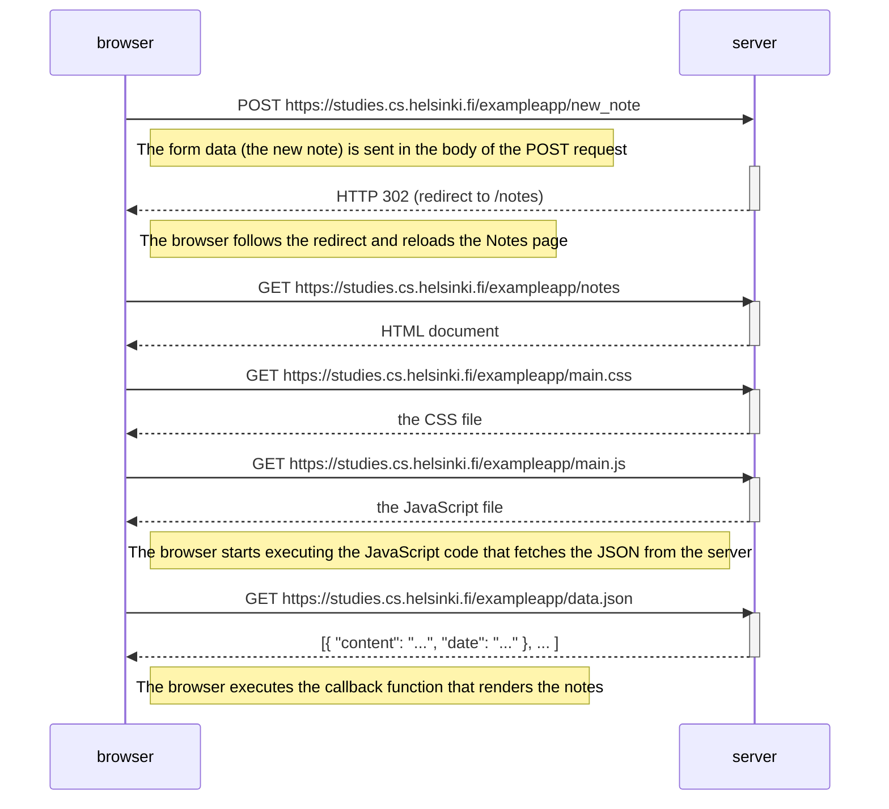
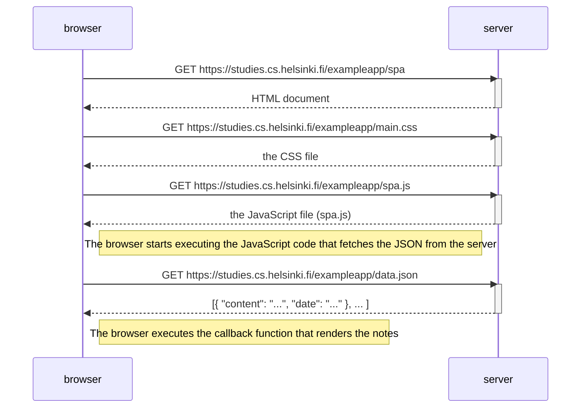
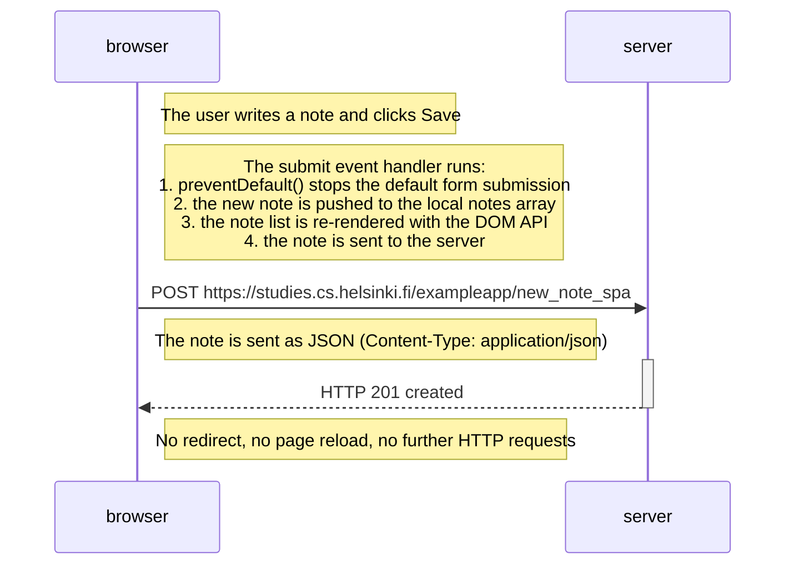

# Part 0 - Fundamentals of Web apps

Exercises 0.4–0.6 of [Full Stack Open](https://fullstackopen.com/en/part0/fundamentals_of_web_apps).

## 0.4: New note diagram

A sequence diagram depicting the chain of events when a user writes something
into the text field and clicks the *Save* button on
<https://studies.cs.helsinki.fi/exampleapp/notes>.

## 0.5: Single page app diagram

A sequence diagram depicting the chain of events when a user opens the
single-page app version of the notes app at
<https://studies.cs.helsinki.fi/exampleapp/spa>.

## 0.6: New note in Single page app diagram

A sequence diagram depicting the chain of events when a user creates a new note
using the single-page app version of the notes app at
<https://studies.cs.helsinki.fi/exampleapp/spa>.

